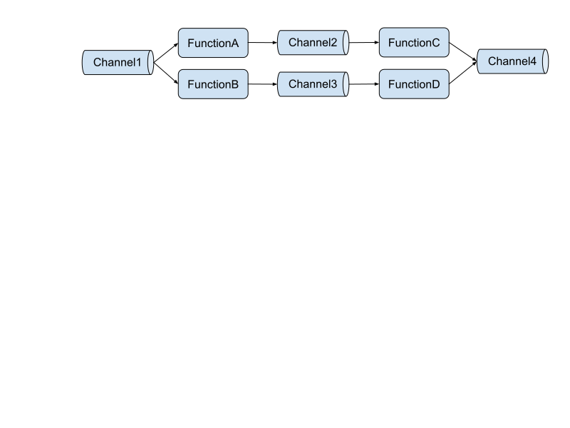
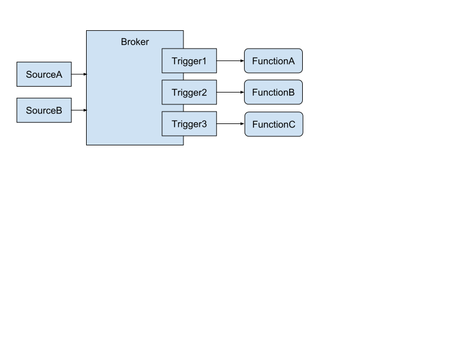

# Separating Eventing and Messaging

Decision date: 6 March 2019

## What

Move Channel and Subscription to the apigroup `messaging.knative.dev` from
`eventing.knative.dev`, to indicate that Channel and Subscription concepts are
more aligned with messaging (i.e. message routing) than eventing (i.e.
content-aware dispatch).

## New API Group charters

### `messaging.knative.dev`

Messaging is explicitly concerned with modelling the event transmission
topology; the route of the message through the topology is specified by the
developer, and the topology determines which functions receive which events.

<!-- Extracted from https://docs.google.com/document/d/1w5Bd5kEiiMk7i7X0EUdy6PFbWUpwGTwep8I0N52esyM/edit by selecting the picture and then "Actions" > "Download As" -->

Message Channels can be used for Pub/Sub messaging where producers and consumers
are decoupled, even temporally: either side can come and go, consumers read at
their own rate, potentially including support for replay, etc. Channels also
provide the building blocks for Enterprise Integration Patterns, such as Routers
and higher level patterns such as Scatter/Gather and may support partitioning,
and stream processing over windows.

### `eventing.knative.dev`

Eventing is a higher-level abstraction which removes explicit management of the
event transmission topology and replaces it with automatically-optimized routing
based on the contents of the event. In this way, it is similar to local
event-driven programming with the Observer pattern.

<!-- Extracted from https://docs.google.com/document/d/1w5Bd5kEiiMk7i7X0EUdy6PFbWUpwGTwep8I0N52esyM/edit by selecting the picture and then "Actions" > "Download As" -->

An Event Broker is a target for emitting events, and Triggers connect event
listeners based on selection criteria. This provides the equivalent of
`emit(foo)` and `on('foo', function(e))` for a distributed system. The
implementation details are hidden.

## Details

This change will be introduced in the 0.5.0 release, and will be phased in.

- In 0.5.0, CRDs will be provided for both apiGroups, and the controllers will
  observe and reconcile both apiGroups (this should be a small amount of
  additional code). Release notes will highlight this change, and recommend that
  users switch to the new apiGroup.
- In 0.6.0, the old `eventing.knative.dev/v1alpha1` Channel and Subscription
  CRDs will not be included in the default release. Depending on customer
  demand, it _might_ be possible to run 0.6.0 with the old style of Channels and
  Subscriptions, but this support might also be completely removed.
- In 0.7.0, the old CRDs will be removed and only the `messaging.knative.dev`
  apiGroup versions of Channels and Subscriptions will be reconciled.

Both `messaging` and `eventing` API objects will be maintained in the
`knative-eventing` repo and will be subject to the same governance and set of
approvers (modulo specific OWNERS files in specific directories). This both
eases the transition above, and reduces the churn of creating and managing
additional repos in the release process.

## Source documents

[Proposal by Mark Fisher](https://docs.google.com/document/d/1w5Bd5kEiiMk7i7X0EUdy6PFbWUpwGTwep8I0N52esyM/edit#)
[Decision by eventing approvers](https://docs.google.com/spreadsheets/d/16aOhfRnkaGcQIOR5kiumld-GmrgGBIm9fppvAXx3mgc/edit?)
