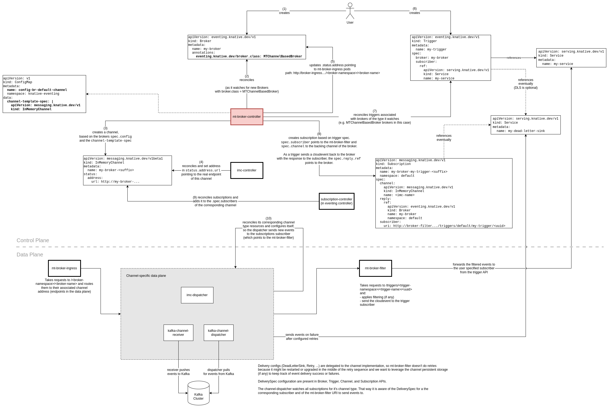

# Multi-tenant channel-based broker

This document gives a rough overview over the Multi-tenant channel-based broker (MTChannelBasedBroker) architecture.

It is possible to use MTChannelBasedBroker with [any channel implementation](https://knative.dev/docs/eventing/channels/channels-crds/). For demonstration purposes, MTChannelBasedBroker is used with an [InMemoryChannel](../../config/channels/in-memory-channel/README.md) in the diagram and throughout the document.



## Control Plane Components

In the following the control plane components and their responsibilities are described.

### mt-broker-controller

The `mt-broker-controller` is kind of the heart of the MTChannelBasedBroker control plane and has the following responsibilities:

* Watches for new `Broker` resources with the `eventing.kantive.dev/broker.class: MTChannelBasedBroker` annotation (step 2 in the diagram) and creates a new _concrete_ channel resource (step 3 in the diagram) depending on the `channel-template-spec` from the configmap referenced in the `config-br-defaults` configmap (by default this points to `config-br-default-channel`).

  Be aware that in case the default `brokerClass` in `config-br-defaults` is not set to `MTChannelBasedBroker`, the referenced configmap still must contain a `channel-template-spec`. Otherwise the user needs to define the corresponding config on the broker resource directly when using the `MTChannelBasedBroker` broker class, e.g.:

  ```
  apiVersion: eventing.knative.dev/v1
  kind: Broker
  metadata:
    annotations:
      eventing.knative.dev/broker.class: MTChannelBasedBroker
    name: default
  spec:
    # Configuration specific to this broker class.
    config:
      apiVersion: v1
      kind: ConfigMap
      name: config-br-default-channel
      namespace: knative-eventing
  ```
* Updates the status on `Broker` resources with the `eventing.kantive.dev/broker.class: MTChannelBasedBroker` annotation with the address for the broker ingress.

### Channel specific controllers (e.g. `imc-controller`)

As we are using `InMemoryChannel` as the backing channel for the broker throughout this document, the channel specific controllers will be related to that implementation.

These controllers (`imc-controller` in our diagram) watch for channel resources created by the `mt-broker-controller` in step 3 (e.g. `InMemoryChannel`) and update the address in the status pointing to the real endpoint of the channel (a service backed by the `imc-dispatcher` and not via the `mt-broker-ingress`).

## Data Plane Components

In the following the data plane components of the MTChannelBasedBroker and their responsibilities are described.

### mt-broker-ingress

The `mt-broker-ingress` takes requests and routes them to the channel specific data plane component (e.g. to the `imc-dispatcher`). The `.status.address` in the Broker resource, points to the `mt-broker-ingress`.

### mt-broker-filter

The `mt-broker-filter` takes requests and filters them according to the trigger spec.

### Channel specific data plane components

The channel specific data plane components are responsible for delivering events to the Subscribers.

The `imc-dispatcher` is the component, which receives new events and sends them directly to the `mt-broker-filter` to apply filtering and to send them to the Subscribers. As it watches for new Subscriptions of its channel type (`kind: InMemoryChannel`), it is aware of the Subscribers.

In contrast to the InMemoryChannel, the channel implementation for Apache Kafka consists of multiple components: The `kafka-channel-receiver` and the `kafka-channel-dispatcher`. The receiver (`kafka-channel-receiver`) is the component which adds events to a Kafka cluster (topic). The dispatcher (`kafka-channel-dispatcher`) on the other hand pulls the Kafka cluster for new messages, packs them into a cloud event and sends them for each Subscriber to the `mt-broker-filter` to apply filtering. As it watches for new Subscriptions of its channel type (`kind: KafkaChannel`), it is aware of the Subscribers. The dispatcher also handles the delivery configs (retry and DeadLetterSink configurations).
