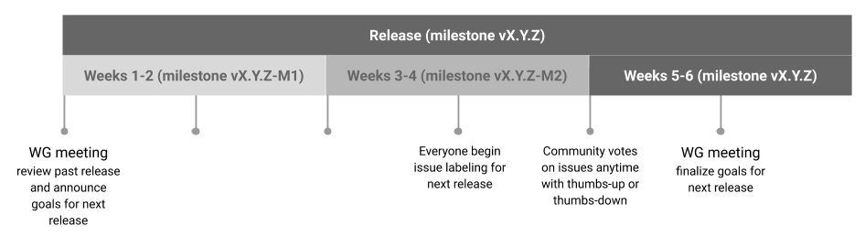

# Knative Eventing Release Planning - Proposal

This document summarizes release planning for Knative Eventing.

Releases and sprints are both represented in Github as Milestones. Releases
span 6 weeks, starting on a Wednesday and ending on a Tuesday 6 weeks later.
Releases are further broken down into 3 2-week sprints.

Each work group (WG) will be responsible for implementing this process.

## Recommended process

No later than midway through a release, start planning for the next release:
- As before, anyone can create new issues for Feature Requests or Bugs.
- Label issues to propose them for a particular release. For example:
proposed/0.13, proposed/0.14.
- Community votes on issues anytime with thumbs-up or thumbs-down.

One week before release:
- WG leads and representatives from each contributing vendor will meet and
finalize the plan with a list of issues they would like to have in the next
release.
- Try not to pack too much into the release. Keep the release backlog tight and
focused.
- All issues in the next release should be assigned to assist with headcount
planning.

After release has started:
- Have bi-weekly sprints. We recommend that everyone leverage sprints to bucket
work rather than trying to push all features to the last 2 weeks of a release.

## Administrivia

- After the start of each release, un-label/re-label remaining issues from the
proposed labels as necessary and delete the proposed label.
- At the end of each release, un-label/re-label issues that were not closed in
the release so that only issues that were completed remain in the release.
