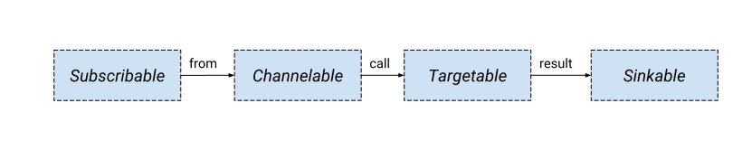

# Interface Contracts

<!-- This image is sourced from https://drive.google.com/open?id=1Mgn0Oz85M9W1Pwfnw3u0OhZmIIxSxcM3lZUEZyPCoB0 -->

---

## Subscribable

A **Subscribable** resource contains a list of subscribers and is responsible
for delivering events to each of them.

### Control Plane

The **Subscribable** resource stores a list of resolved _Subscriptions_. The
Subscription Controller is responsible for resolving any ObjectReferences (such
as _call_ and _result_) in the _Subscription_ to network addresses.

### Data Plane

**Subscribable** resources will attempt delivery to each of the _subscribers_
at least once, and retry if the subscriber returns errors.

---

## Targetable

A **Targetable** resource represents an endpoint that receives events and
optionally returns events to forward downstream. One example of a _Targetable_
is a function.

### Control Plane

A **Targetable** resource MUST expose a _status.targetable.domainInternal_
field. The _domainInternal_ value is an internal domain name that is capable of
receiving event deliveries. _Targetable_ resources may be referenced in the
_call_ section of a _Subscription_.

### Data Plane

The **Targetable** resource receives one event and returns zero or more events
in response. The returned events are not required to be related to the received
event. The _Targetable_ should return a successful response if the event was
processed successfully.

The _Targetable_ is not responsible for ensuring successful delivery of any
received or returned event. It may receive the same event multiple times even
if it previously indicated success.

---

## Sinkable

A **Sinkable** resource receives events and takes responsibility for further
delivery. Unlike _Targetable_, a _Sinkable_ cannot return events in its
response. One example of a _Sinkable_ is a _Channel_.

### Control Plane

A **Sinkable** resource MUST expose a _status.sinkable.domainInternal_ field.
The _domainInternal_ value is an internal domain name that is capable of
receiving event deliveries. _Sinkable_ resources may be referenced in the
_result_ section of a _Subscription_.

### Data Plane

A **Sinkable** resource will only respond to requests with success of failure.
Events returned to the caller will be reported or ignored.

---

_Navigation_:

- [Motivation and goals](motivation.md)
- [Resource type overview](overview.md)
- **Interface contracts**
- [Object model specification](spec.md)
