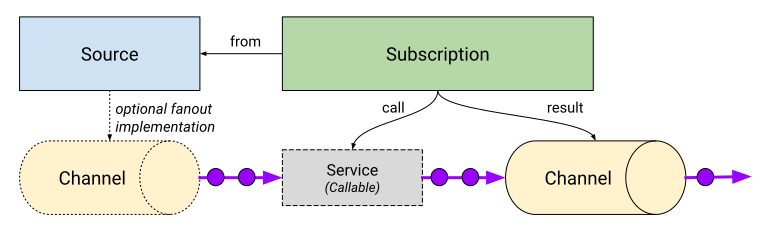

# Resource Types

The API defines and provides a complete implementation for
[Subscription](spec.md#kind-subscription) and abstract resource definitions
for [Channels](spec.md#kind-channel) and
[ClusterChannelProvisioners](spec.md#kind-clusterchannelprovisioner) which may
be fulfilled by multiple backing implementations (much like the Kubernetes
Ingress resource).

With extensibility and composability as a goal of Knative Eventing, the
eventing API defines several resources that can be reduced down to well
understood contracts. These eventing resource interfaces may be fulfilled by
other Kubernetes objects and then composed in the same way as the concrete
objects. The interfaces are ([Sinkable](interfaces.md#sinkable),
[Subscribable](interfaces.md#Subscribable),
[Targetable](interfaces.md#targetable)). For more details, see
[Interface Contracts](interfaces.md).

- A **Subscription** describes the transformation of an event and optional
  forwarding of a returned event.

- A **Channel** provides event persistence and fanout of events from a
  well-known input address to multiple outputs described by _Subscriptions_.

<!-- This image is sourced from https://drive.google.com/open?id=10mmXzDb8S_4_ZG_hcBr7s4HPISyBqcqeJLTXLwkilRc -->

- **ClusterChannelProvisioners** implement strategies for realizing backing resources
  for different implementations of _Channels_ currently active in the eventing
  system.

<!-- This image is sourced from https://drive.google.com/open?id=1o_0Xh5VjwpQ7Px08h_Q4qnaOdMjt4yCEPixRFwJQjh8 -->

Sources are defined by independent CRDs that can be installed into a cluster.
For more information see [Knative Eventing
Sources](https://github.com/knative/eventing-sources).

## Subscription

**Subscriptions** describe a flow of events from one _Channel_ to the next
Channel\* through transformations (such as a Knative Service which processes
CloudEvents over HTTP). A _Subscription_ controller resolves the addresses of
transformations (`call`) and destination storage (`result`) through the
_Targetable_ and _Sinkable_ interface contracts, and writes the resolved
addresses to the _Channel_ in the `from` reference. _Subscriptions_ do not need
to specify both a transformation and a storage destination, but at least one
must be provided.

All event delivery linkage from a **Subscription** is 1:1 – only a single
`from`, `call`, and `result` may be provided.

For more details, see [Kind: Subscription](spec.md#kind-subscription).

## Channel

**Channel** provides an event delivery mechanism which can fan out received
events to multiple destinations via _Subscriptions_. A _Channel_ has a single
inbound _Sinkable_ interface which may accept events delivered directly or
forwarded from multiple _Subscriptions_. Different _Channels_ may implement
different degrees of persistence. Event delivery order is dependent on the
backing implementation of the _Channel_ provided by the
_ClusterChannelProvisioner_.

Event selection on a _Channel_ is 1:N – a single _Channel_ may fan out to
multiple _Subscriptions_.

See [Kind: Channel](spec.md#kind-channel).

## ClusterChannelProvisioner

**ClusterChannelProvisioner** catalogs available implementations of _Channels_.
_ClusterChannelProvisioners_ hold a JSON Schema that is used to validate the
_Channel_ input arguments. _ClusterChannelProvisioners_ make it possible to
provide cluster wide defaults for the _Channels_ they provision.

_ClusterChannelProvisioners_ do not directly handle events. They are 1:N with
_Channels_.

For more details, see [Kind:
ClusterChannelProvisioner](spec.md#kind-clusterchannelprovisioner).

---

_Navigation_:

- [Motivation and goals](motivation.md)
- **Resource type overview**
- [Interface contracts](interfaces.md)
- [Object model specification](spec.md)
