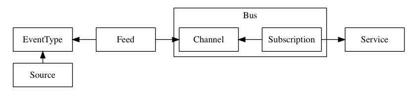

# Resource Groups

Knative Eventing API is grouped into _Channels_, _Feeds_ and _Flows_:

* _Channels_ define an abstraction between the eventing infrastructure and the
  consumption and production of the events.

* _Feeds_ bridge the event source into the eventing framework.

* _Flows_ abstract the path of an event from a source takes to reach an event
  consumer.

Typically, _Feeds_ perform out-of-cluster provisioning, while _Channels_ are
within-cluster management of event delivery. _Flows_ is a higher order wrapper
used to connect event producers directly with event consumers leveraging 
_Feeds_ and _Channels_.

# Resource Types

The primary resources in the Knative Eventing _Feeds_ API are EventSource,
EventType and Feed:

* **EventSource**, an archetype of an event producer.

* **EventType**, the schema for an event. 

* **Feed**, the association between the output of an event producer to the
  input of an event consumer.

An example _Feeds_ setup: GitHub would be the _EventSource_, a Pull Request
notification would be the _EventType_ and the _Feed_ describes the _org/repo_,
credentials, the specific _EventType_ and the consumer of the _Feed_ events.

The primary resources in the Knative Eventing _Channels_ API are Channel,
Subscription and Bus:

* **Channel**, a named endpoint which accepts and forwards events.

* **Bus**, an implementation of an event delivery mechanism.

* **Subscription**, an expressed interest in events from a _Channel_ to be
  delivered to an HTTP endpoint.

An example _Channels_ setup: A _Channel_ has declared it is implemented by a
PubSubBusImpl. The PubSubBusImpl _Bus_ accepts input from an event producer
that is pushing events to the _Channel_. The _Bus_ also watches for
_Subscription_(s) on the _Channel_ and delivers the events accepted to the
consumer.

The _Flows_ API implements a single resource, Flow:

* **Flow**, is an abstraction of the connection between an event producer to
  the event consumer leveraging _Feed_s and _Channels_.

An example _Flows_ setup: The _Flow_ describes the same properties as the _Feed_
except the target could be a _Service.serving.knative.dev_ and the _Flow_ will
create the _Channel_, _Feed_, and _Subscription_ for the event to flow from
event producer (GitHub) to event consumer (MyService).

See the [Knative Eventing Docs
Architecture](https://github.com/knative/docs/blob/master/eventing/README.md#architecture)
for more details.

